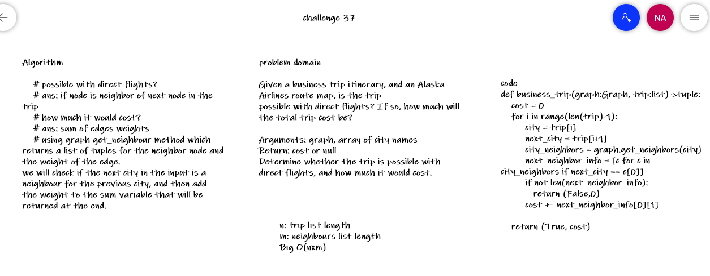

# Challenge Summary
<!-- Description of the challenge -->
Determine whether the trip is possible with direct flights, and how much it would cost.
## Whiteboard Process
<!-- Embedded whiteboard image -->

## Approach & Efficiency
<!-- What approach did you take? Why? What is the Big O space/time for this approach? -->
possible with direct flights?

ans: if node is neighbor of next node in the trip

how much it would cost?

ans: sum of edges weights

using graph get_neighbour method which returns a list of tuples for the neighbor node and the weight of the edge.

we will check if the next city in the input is a neighbour for the previous city, and then add the weight to the sum variable that will be returned at the end.
## Solution
<!-- Show how to run your code, and examples of it in action -->
n: trip list length
m: neighbours list length
Big O(nxm)
