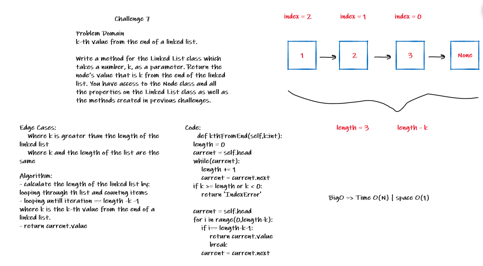

# Challenge Summary
<!-- Description of the challenge -->
k-th value from the end of a linked list.

Write a method for the Linked List class which takes a number, k, as a parameter. Return the node’s value that is k from the end of the linked list. You have access to the Node class and all the properties on the Linked List class as well as the methods created in previous challenges.

## Whiteboard Process
<!-- Embedded whiteboard image -->


## Approach & Efficiency
<!-- What approach did you take? Why? What is the Big O space/time for this approach? -->


- calculate the length of the linked list by:
looping through th list and countng items
- looping untill iteration == length -k -1
where k is the k-th value from the end of a linked list.
- return current.value


BigO => Time O(N) | space O(1)

## Solution
<!-- Show how to run your code, and examples of it in action -->
clone the repo `git clone https://github.com/NizarAlsaeed/data-structures-and-algorithms.git`

change directory `cd python/Data_Structures/linked_list`

open linked_list.py

run the file
```python
ll = Linked_list()
for i in range(1,10):
    ll.append(i)
print(ll.kthFromEnd(4))

#>>> 5
```
