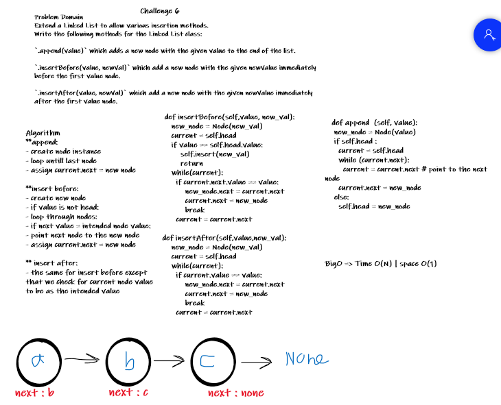

# Challenge Summary
<!-- Description of the challenge -->
Extend a Linked List to allow various insertion methods.
Write the following methods for the Linked List class:

`.append(value)` which adds a new node with the given value to the end of the list.

`.insertBefore(value, newVal)` which add a new node with the given newValue immediately before the first value node.

`.insertAfter(value, newVal)` which add a new node with the given newValue immediately after the first value node.

## Whiteboard Process
<!-- Embedded whiteboard image -->


## Approach & Efficiency
<!-- What approach did you take? Why? What is the Big O space/time for this approach? -->

**append:
- create node instance
- loop untill last node
- assign current.next = new node

**insert before:
- create new node
- if value is not head:
- loop through nodes:
- if next value = intended node value:
- point next node to the new node
- assign current.next = new node

** insert after:
- the same for insert before except
that we check for current node value
to be as the intended value


BigO => Time O(N) | space O(1)


## Solution
<!-- Show how to run your code, and examples of it in action -->

#### getting started:
clone the repo `git clone https://github.com/NizarAlsaeed/data-structures-and-algorithms.git`

change directory `cd python/Data_Structures/linked_list`

open linked_list.py

create new instance `linked_list = Linked_list()`

add some data
```
linked_list.append(1)
linked_list.append(2)
linked_list.append(3)
```

print the linked list visualization
```
print(linked_list.__str__())

# output:
# {1} -> {2} -> {3} -> None
```

try the available methods, such as `.insertAfter`:
```
linked_list.insertAfter(3,4)

# output:
# {1} -> {2} -> {3} -> {4} -> None
```
