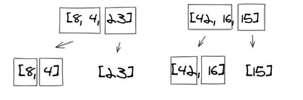
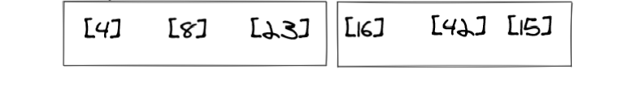
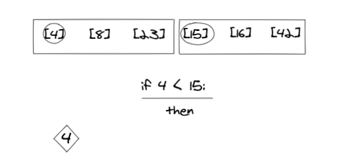
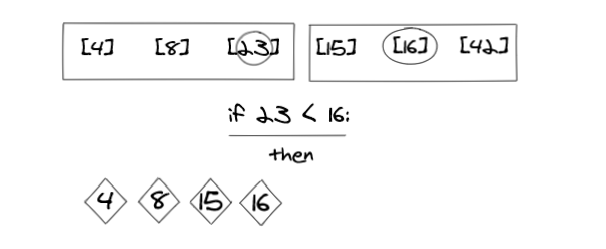

# Merge Sort

This sorting algorithm takes less time than insertion sorting and of course than bubble sorting.

The idea behind it is that the array is divided from the middle recursively into left and right parts until the array are no longer dividable (has only one item), then within each array(left and right) the values are compared and sorted and at the end the two arrays are compared and merged.  

## example:

### step 1:
the array is divided from the middle into left and right arrays.

### step 2:
the two arrays are again and again divided from the middle until they have one item only.

### step 3:
each array values are internally compared and sorted.

### step 4:
Now, the left and right arrays are compared value by value as shown below and the smaller value is added to the array.      

### step 5:

### step 6:

### step 7:

### step 8:

### step 9:
the last step is to add the remaining values from the right array to the main array.

