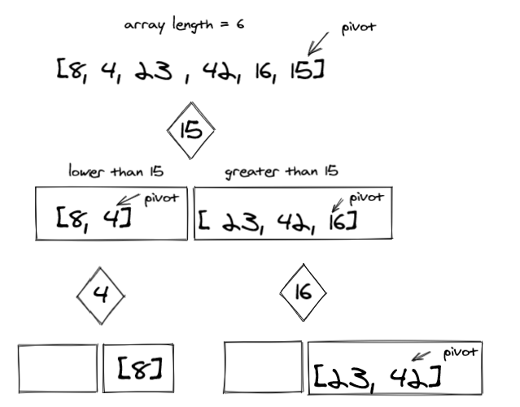

# Challenge Summary
<!-- Description of the challenge -->
create a blog article that shows the step-by-step output after each iteration through some sort of visual.
then code a working, tested implementation of Quick Sort based on the pseudocode provided.

## Whiteboard Process
<!-- Embedded whiteboard image -->


## Approach & Efficiency
<!-- What approach did you take? Why? What is the Big O space/time for this approach? -->

Applied the pseudocode provided with the challenge
```
ALGORITHM QuickSort(arr, left, right)
    if left < right
        // Partition the array by setting the position of the pivot value
        DEFINE position <-- Partition(arr, left, right)
        // Sort the left
        QuickSort(arr, left, position - 1)
        // Sort the right
        QuickSort(arr, position + 1, right)

ALGORITHM Partition(arr, left, right)
    // set a pivot value as a point of reference
    DEFINE pivot <-- arr[right]
    // create a variable to track the largest index of numbers lower than the defined pivot
    DEFINE low <-- left - 1
    for i <- left to right do
        if arr[i] <= pivot
            low++
            Swap(arr, i, low)

     // place the value of the pivot location in the middle.
     // all numbers smaller than the pivot are on the left, larger on the right.
     Swap(arr, right, low + 1)
    // return the pivot index point
     return low + 1

ALGORITHM Swap(arr, i, low)
    DEFINE temp;
    temp <-- arr[i]
    arr[i] <-- arr[low]
    arr[low] <-- temp

```

BigO(n log (n))
Worst case: BigO(n^2)

## Solution
<!-- Show how to run your code, and examples of it in action -->

```python
def QuickSort(arr, left, right):
    if left < right:
        # Partition the array by setting the position of the pivot value
        position = Partition(arr, left, right)
        # Sort the left
        QuickSort(arr, left, position - 1)
        # Sort the right
        QuickSort(arr, position + 1, right)
    return arr


def Partition(arr, left, right):
    # set a pivot value as a point of reference
    pivot = arr[right]
    # create a variable to track the largest index of numbers lower than the defined pivot
    low = left - 1
    for i in range(left, right):
        if arr[i] <= pivot:
            low += 1
            Swap(arr, i, low)

    # place the value of the pivot location in the middle.
    # all numbers smaller than the pivot are on the left, larger on the right.
    Swap(arr, right, low + 1)
    # return the pivot index point
    return low + 1


def Swap(arr, i, low):
    temp = arr[i]
    arr[i] = arr[low]
    arr[low] = temp

if __name__ == '__main__':
    arr= [8,4,23,42,16,15]
    print(QuickSort(arr, 0, len(arr)-1))

# [4,8,15,16,23,42]
```
