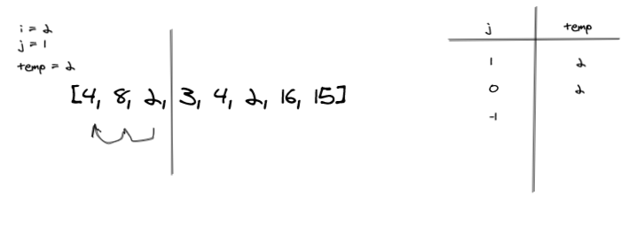

# Challenge Summary
<!-- Description of the challenge -->
create a blog article that shows the step-by-step output after each iteration for insertion sort algorithm through some sort of visual.

## Whiteboard Process
<!-- Embedded whiteboard image -->


## Approach & Efficiency
<!-- What approach did you take? Why? What is the Big O space/time for this approach? -->


Applied the pseudocode provided with the challenge
```
  InsertionSort(int[] arr)
  
    FOR i = 1 to arr.length
    
      int j <-- i - 1
      int temp <-- arr[i]
      
      WHILE j >= 0 AND temp < arr[j]
        arr[j + 1] <-- arr[j]
        j <-- j - 1
        
      arr[j + 1] <-- temp
```

BigO(n^2)

## Solution
<!-- Show how to run your code, and examples of it in action -->

```python
def insertion_sort(arr: list):

    for i in range(len(arr)):

        j = i - 1
        temp = arr[i]

        while j >= 0 and temp < arr[j]:
            arr[j + 1] = arr[j]
            j = j - 1

        arr[j + 1] = temp

    return arr


print(insertion_sort([8, 4, 23, 42, 16, 15]))

# [4,8,15,16,23,42]
```
