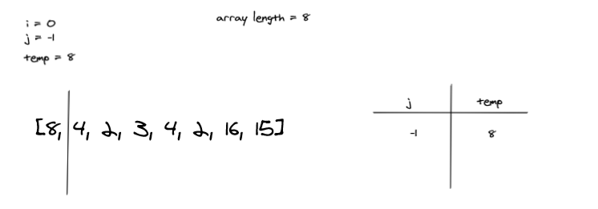
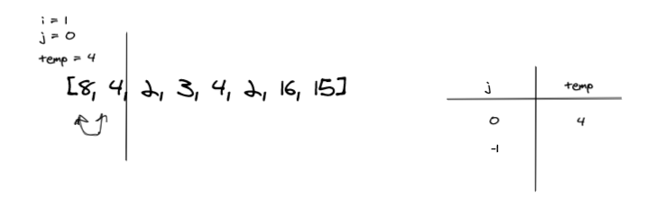
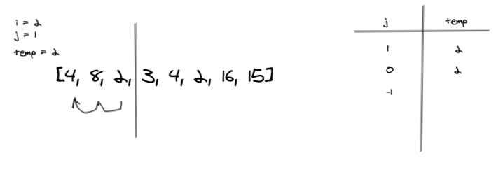
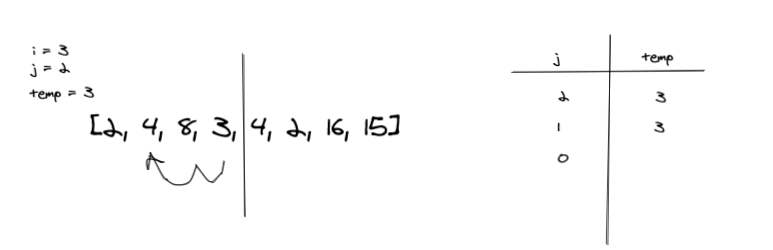
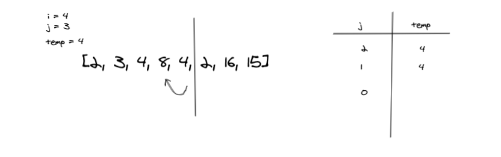
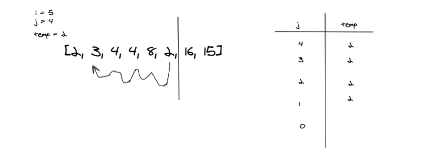
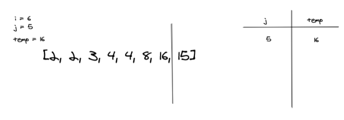
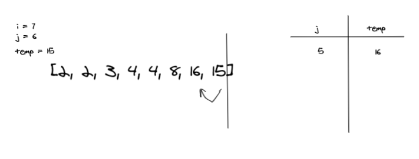
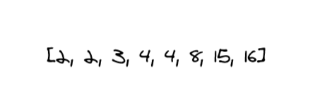

# Insertion Sort

Insertion Sort is one of the sorting algorithms, it is less efficient than the other more advanced sorting algorithm, but it is also simple and considered much faster than the bubble sort algorithm.
## Pseudocode
```
InsertionSort(int[] arr)

   FOR i = 1 to arr.length

     int j <-- i - 1
     int temp <-- arr[i]

     WHILE j >= 0 AND temp < arr[j]
       arr[j + 1] <-- arr[j]
       j <-- j - 1

     arr[j + 1] <-- temp
```

### i=0:

on the first iteration, because j is not >=1, the condition is false and the while loop is skipped


on the second iteration, temp = 4, and it is compared to the previous values which is 8 only. while 4 is less than 8, the 4 will be positioned before the 8 value.
### i=1:


on the third iteration, temp = 2, and it is compared with the previous values which are 8 and 4. the 2 will be positioned before the 8 and then compared with the 4 and positioned again before it, so, the whole section is sorted correctly.
### i=2:


on the fourth iteration, temp = 3, and it is compared to the previous values 8,4, and 2. the 3 will be compared with 8 at first and replaced with it because it is smaller than it, and the process repeated with the 4 and 2, thus it will be replaced after the 2.
### i=3:


from the fifth iteration to the last item in the array, the process is repeated until the whole  array is sorted as shown on the images below.
### i=4:



### i=5:



### i=6:



### i=7:



as seen below, the array is sorted correctly after the 8th iteration.



## run-time:

from the algorithm structure it can be noticed that the Time complexity may reach to  O(n²).
