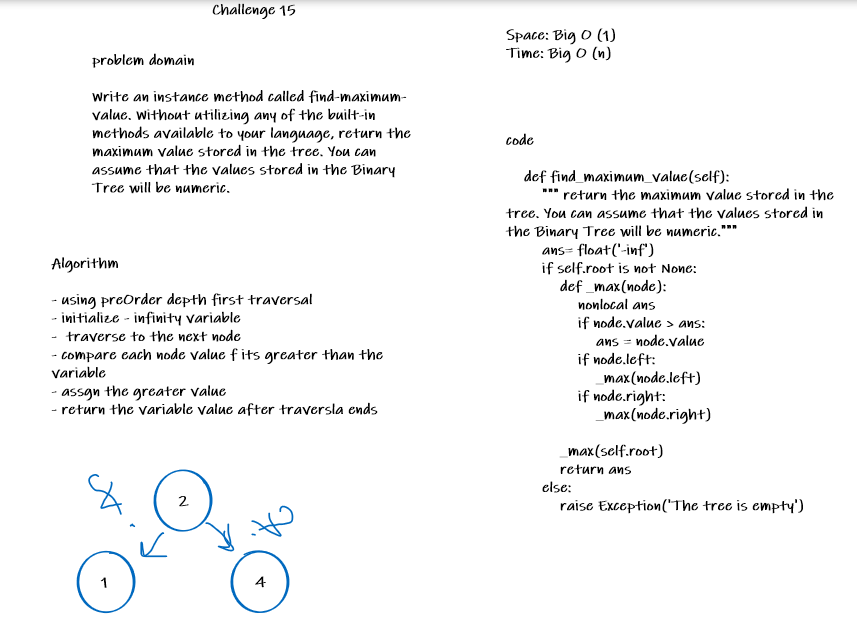

# Challenge Summary
<!-- Description of the challenge -->
**Find the Maximum Value in a Binary Tree.**

Write an instance method called find-maximum-value. Without utilizing any of the built-in methods available to your language, return the maximum value stored in the tree. You can assume that the values stored in the Binary Tree will be numeric.

## Whiteboard Process
<!-- Embedded whiteboard image -->

## Approach & Efficiency
<!-- What approach did you take? Why? What is the Big O space/time for this approach? -->
- using preOrder depth first traversal
- initialize - infinity variable
-  traverse to the next node
- compare each node value f its greater than the variable
- assgn the greater value
- return the variable value after traversla ends

space: BigO(1) | time BigO(n)

## Solution
<!-- Show how to run your code, and examples of it in action -->
```python
    abs_root = Node_BT(2)

    abs_root.left = Node_BT(7)
    abs_root.right = Node_BT(5)

    abs_root.left.left = Node_BT(2)
    abs_root.left.right = Node_BT(6)

    abs_root.right.right = Node_BT(9)
    binary_tree = BinaryTree(abs_root)
    print(binary_tree.find_maximum_value())

# output
>>> 9
```

