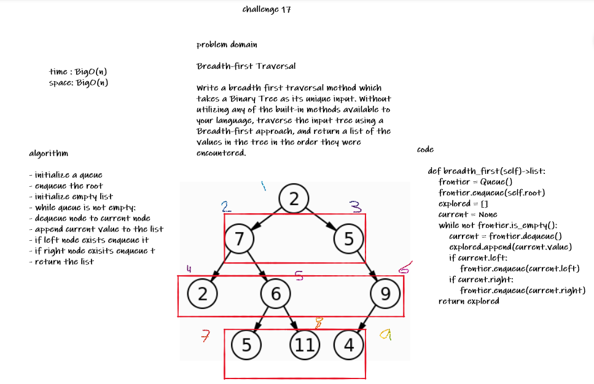

# Challenge Summary
<!-- Description of the challenge -->
**Breadth-first Traversal.**

Write a breadth first traversal method which takes a Binary Tree as its unique input. Without utilizing any of the built-in methods available to your language, traverse the input tree using a Breadth-first approach, and return a list of the values in the tree in the order they were encountered.

## Whiteboard Process
<!-- Embedded whiteboard image -->

## Approach & Efficiency
<!-- What approach did you take? Why? What is the Big O space/time for this approach? -->

- initialize a queue
- enqueue the root
- initialize empty list
- while queue is not empty:
- dequeue node to current node
- append current value to the list
- if left node exists enqueue it
- if right node exisits enqueue t
- return the list

space: BigO(n) | time BigO(n)

## Solution
<!-- Show how to run your code, and examples of it in action -->
```python
    abs_root = Node_BT(2)

    abs_root.left = Node_BT(7)
    abs_root.right = Node_BT(5)

    abs_root.left.left = Node_BT(2)
    abs_root.left.right = Node_BT(6)

    abs_root.right.right = Node_BT(9)

    abs_root.left.right.left = Node_BT(5)
    abs_root.left.right.right = Node_BT(11)

    abs_root.right.right.right = Node_BT(4)

    binary_tree = BinaryTree(abs_root)
    print(binary_tree.breadth_first())

# output
>>> [2, 7, 5, 2, 6, 9, 5, 11, 4]
```

