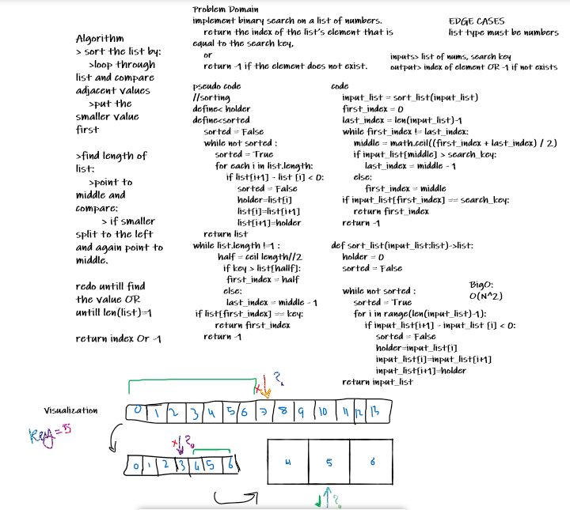

# Challenge Summary
implement binary search on a list of numbers.

## Challenge Description
search for a vlaue inside a given list using binary search algorithm.
return the index of the list’s element that is equal to the search key,
or
return -1 if the element does not exist.

## Approach & Efficiency
-   sort the list by:
-   loop through list and compare adjacent values
-   put the smaller value first
-   find length of list:
-   point to middle and compare:
-   if smaller split to the left and again point to middle.
-   redo untill find the value OR untill len(list)=1
-   return index Or -1

BigO => O(N²)

## Solution

