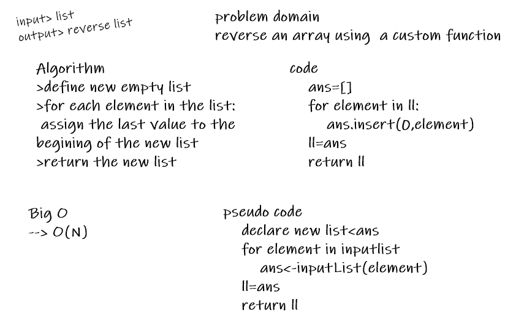

# Reverse an Array
array reversing

## Challenge
reverse an array without using the built in methods

## Approach & Efficiency
loop throw the input list and assign the latest value to the beginings of a new list, and then return the new list.

BigO => O(N)

## Solution

