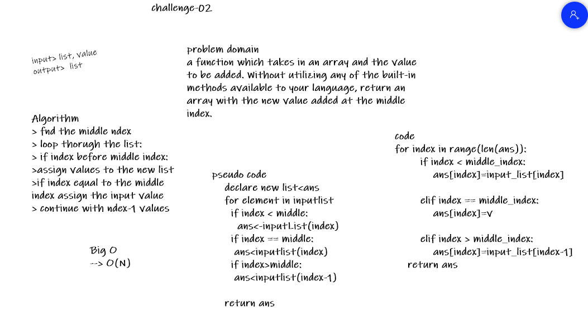

# Challenge Summary
add value to the middle of a list

## Challenge Description
takes in a list and the value to be added.
return a list with the new value added at the middle index.

## Approach & Efficiency
-   find the middle ndex
-   loop thorugh the list:
-   if index before middle index:
-   assign values to the new list
-   if index equal to the middle index assign the input value
-   continue with ndex-1 values

BigO => O(N)

## Solution

