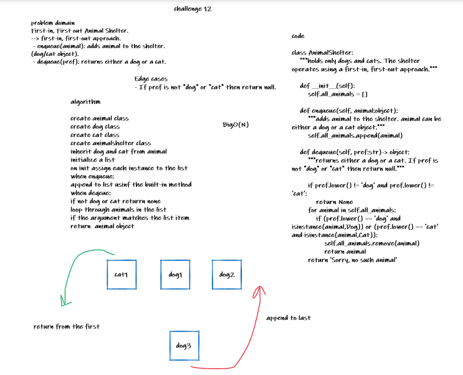

# Challenge Summary
<!-- Description of the challenge -->

Create a class called AnimalShelter which holds only dogs and cats. The shelter operates using a first-in, first-out approach.
Implement the following methods:
    enqueue(animal): adds animal to the shelter. animal can be either a dog or a cat object.
    dequeue(pref): returns either a dog or a cat. If pref is not "dog" or "cat" then return null.


## Whiteboard Process
<!-- Embedded whiteboard image -->


## Approach & Efficiency
<!-- What approach did you take? Why? What is the Big O space/time for this approach? -->
initialize a list

on init assign each instance to the list

when enqueue:
append to list usinf the built-in method

when deqeue:
if not dog or cat returrn none

loop through animals in the list
if the argument matches the list item
return  animal object

BigO(N)
## Solution
<!-- Show how to run your code, and examples of it in action -->
```python
animal_shelter = AnimalShelter()
print(animal_shelter)
ketty = Cat('ketty', 1)
rex = Dog('rex',2)
jack = Dog('jack', 3)

animal_shelter.enqueue(ketty)
animal_shelter.enqueue(rex)
animal_shelter.enqueue(jack)
print(animal_shelter)

animal_shelter.dequeue('dog')
print(animal_shelter)

animal_shelter.dequeue('cat')
print(animal_shelter)

#Output:
# ketty, rex, jack
# ketty, jack
# jack

```
