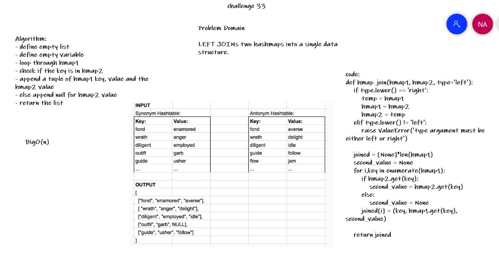

# Hashmap LEFT JOIN
<!-- Short summary or background information -->
LEFT JOIN two hashmaps into a single data structure.
## Challenge
<!-- Description of the challenge -->
Write a function that LEFT JOINs two hashmaps into a single data structure.
The first parameter is a hashmap that has word strings as keys, and a synonym of the key as values.
The second parameter is a hashmap that has word strings as keys, and antonyms of the key as values.

Combine the key and corresponding values (if they exist) into a new data structure according to LEFT JOIN logic.
## Approach & Efficiency
<!-- What approach did you take? Why? What is the Big O space/time for this approach? -->
- define empty list
- define empty variable
- loop through hmap1 
- check if the key is in hmap2 
- append a tuple of hmap1 key, value and the hmap2 value
- else append null for hmap2 value
- return the list

BigO(n)
## Solution
<!-- Embedded whiteboard image -->

