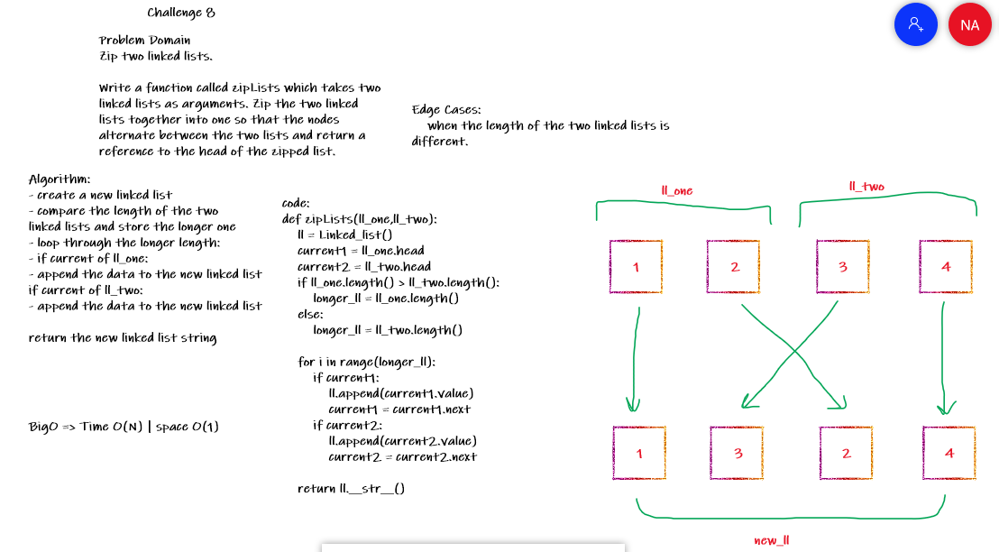

# Challenge Summary
<!-- Description of the challenge -->
Zip two linked lists.

Write a function called zipLists which takes two linked lists as arguments. Zip the two linked lists together into one so that the nodes alternate between the two lists and return a reference to the head of the zipped list.

## Whiteboard Process
<!-- Embedded whiteboard image -->

## Approach & Efficiency
<!-- What approach did you take? Why? What is the Big O space/time for this approach? -->
- create a new linked list
- compare the length of the two
linked lists and store the longer one
- loop through the longer length:
- if current of ll_one:
- append the data to the new linked list
if current of ll_two:
- append the data to the new linked list

return the new linked list string

BigO => Time O(N) | space O(1)


## Solution
<!-- Show how to run your code, and examples of it in action -->
clone the repo `git clone https://github.com/NizarAlsaeed/data-structures-and-algorithms.git`

change directory `cd python/Data_Structures/ll_zip`

open ll_zip.py

create two linked lists, for example:
```python
ll1 = Linked_list()
for i in range(1,5):
    ll1.append(i)

ll2 = Linked_list()
for i in range(5,10):
    ll2.append(i)

# call the function
print(zipLists(ll1,ll2))

#>>> {1} -> {5} -> {2} -> {6} -> {3} -> {7} -> {4} -> {8} -> {9} -> None
```
