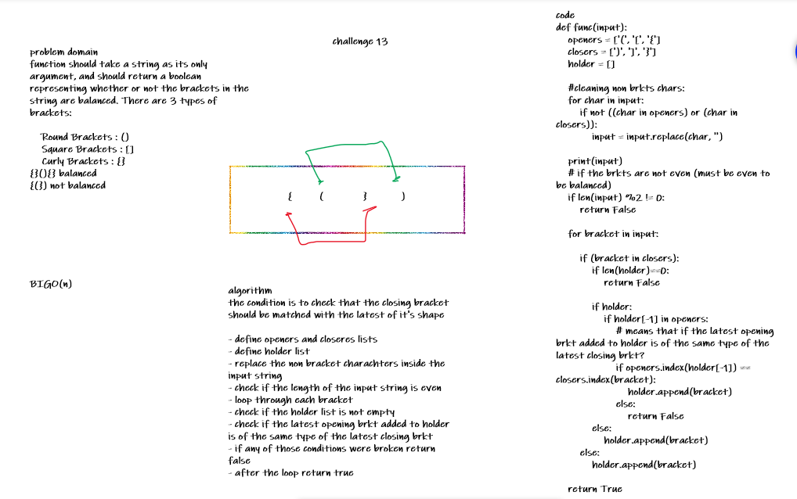

# Challenge Summary
<!-- Description of the challenge -->
function should take a string as its only argument, and should return a boolean representing whether or not the brackets in the string are balanced. There are 3 types of brackets:

    Round Brackets : ()
    Square Brackets : []
    Curly Brackets : {}

- {}(){} balanced
- {(}) not balanced

## Whiteboard Process
<!-- Embedded whiteboard image -->

## Approach & Efficiency
<!-- What approach did you take? Why? What is the Big O space/time for this approach? -->
- check if the holder list is not empty
- check if the latest opening brkt added to holder is of the same type of the latest closing brkt
- if any of those conditions were broken return false

BigO(n)
## Solution
<!-- Show how to run your code, and examples of it in action -->
```python
tl = ['{}' ,'{}(){}', '[[()]]','()[[Extra Characters]]', '(){}[[]]', '{}{Code}[Fellows](())']
for st in tl:
    print(multi_bracket_validation(st))
#output
{}
True
{}(){}
True
[[()]]
True
()[[]]
True
(){}[[]]
True
{}{}[](())
True
```

```python
fl =['[({}]', '(](', '{(})']
for st in fl:
    print(multi_bracket_validation(st))
#output
[({}]
False
(](
False
{(})
False
```
