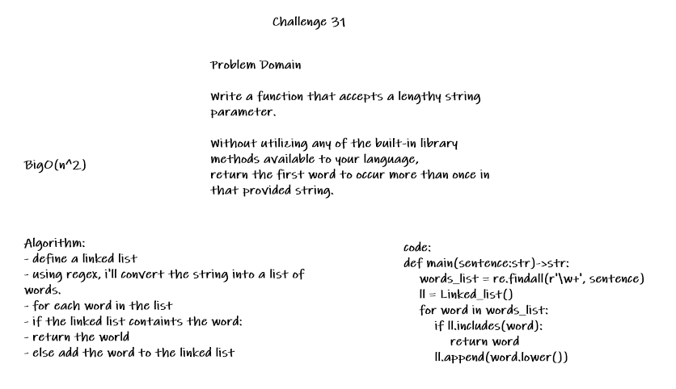

# Challenge Summary
<!-- Description of the challenge -->
Write a function that accepts a lengthy string parameter.

Without utilizing any of the built-in library methods available to your language,
return the first word to occur more than once in that provided string.
## Whiteboard Process
<!-- Embedded whiteboard image -->

## Approach & Efficiency
<!-- What approach did you take? Why? What is the Big O space/time for this approach? -->
- define a linked list
- using regex, i'll convert the string into a list of words.
- for each word in the list
- if the linked list containts the word:
- return the world
- else add the word to the linked list

BigO(n^2)
## Solution
<!-- Show how to run your code, and examples of it in action -->
```python
def main(sentence:str)->str:
    """return the first word to occur more than once in that provided string"""
    words_list = re.findall(r'\w+', sentence)
    ll = Linked_list()
    for word in words_list:
        if ll.includes(word):
            return word
        ll.append(word.lower())

print(main("Once upon a time, there was a brave princess who..."))

>> a
```
